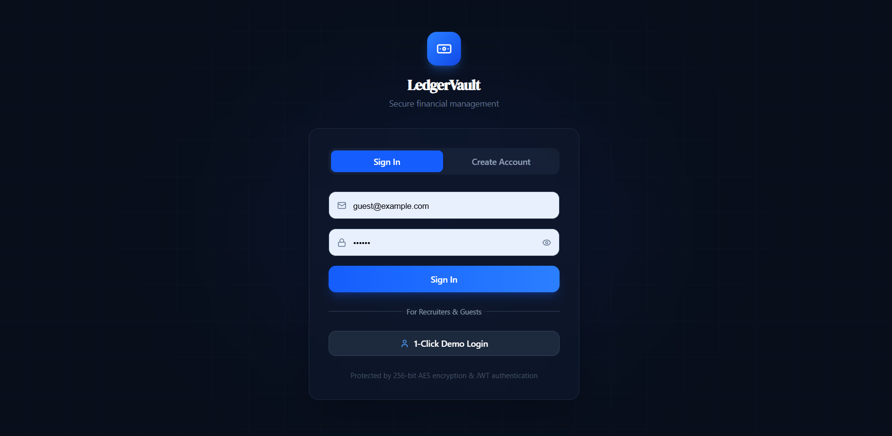
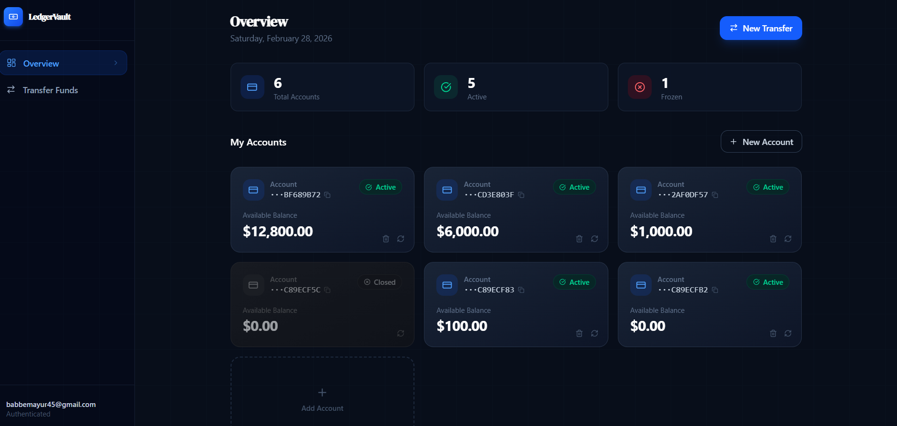

# LedgerVault - Frontend Application

The official frontend UI for the LedgerVault banking system. Built with React and Tailwind CSS, this application provides a sleek, modern, and highly responsive user interface for secure financial management. It communicates seamlessly with the LedgerVault backend API to handle real-time balances, account creation, and secure money transfers.

## 🚀 Key UX & Frontend Features

* **1-Click Recruiter Demo:** A dedicated quick-login system that instantly authenticates guests, bypassing the registration friction so recruiters can immediately test the app.
* **Smart Transfer Interface:** A dynamic transfer modal that allows users to toggle seamlessly between sending money to their own accounts vs. external users.
* **Email Resolution System:** Instead of forcing users to memorize database IDs, the frontend securely resolves recipient emails to active account IDs, mimicking real-world apps like PayPal or Zelle.
* **Client-Side Idempotency:** The frontend automatically generates UUIDv4 idempotency keys for every transfer, preventing accidental double-charges if a user double-clicks the "Send" button.
* **Strict Client-Side Validation:** Prevents unnecessary API calls by validating email formats, password strength, and ensuring transfer amounts are greater than $0 before submission.
* **Real-Time UI Feedback:** Features a custom-built, lightweight Toast notification system to provide instant success/error feedback, alongside loading spinners for all async actions.
* **Secure Cookie Handling:** Configured with `credentials: 'include'` to securely transmit HTTP-only JWT cookies to the backend without exposing them to JavaScript.

## 🛠️ Tech Stack

* **Framework:** React.js (via Vite)
* **Styling:** Tailwind CSS
* **Icons:** Lucide React
* **API Communication:** Native Fetch API with custom wrappers

## 📷 Screenshots





## ⚙️ Local Setup & Installation

**1. Clone the repository**
```bash
git clone [https://github.com/yourusername/ledgervault-frontend.git](https://github.com/yourusername/ledgervault-frontend.git)
cd ledgervault-frontend

```

**2. Install dependencies**

```bash
npm install

```

**3. Configure Environment Variables**
Create a `.env` file in the root directory. You will need to point the frontend to your deployed backend URL.

```env
# Example for Vite
VITE_API_BASE_URL=[https://your-deployed-backend-url.onrender.com/api](https://your-deployed-backend-url.onrender.com/api)

```

*(Note: Ensure your `API` helper object in `App.jsx` uses this environment variable for its `base` URL!)*

**4. Run the development server**

```bash
npm run dev

```

## 🌐 Deployment Notes

This frontend is designed to be easily deployed on platforms like **Vercel**, **Netlify**, or **Render**.

* Ensure that the backend's CORS configuration allows requests from your deployed frontend domain.
* Ensure the backend sets `SameSite=None` and `Secure=true` on the JWT cookies so they work correctly across different domains in production.


